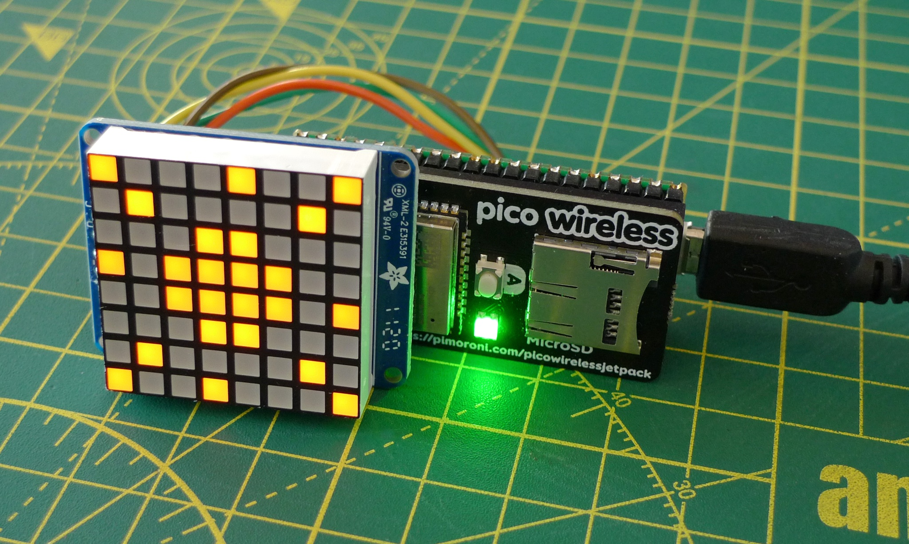
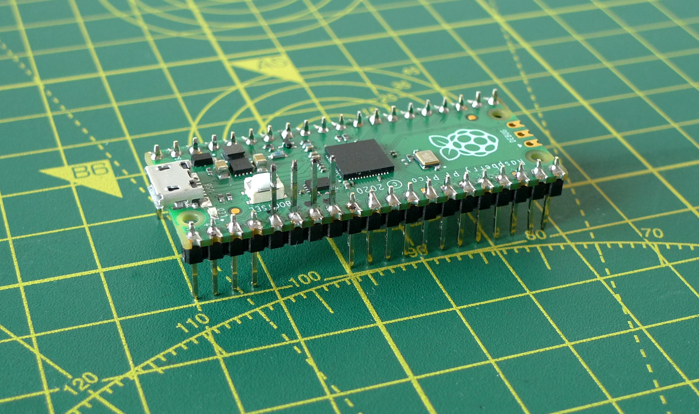
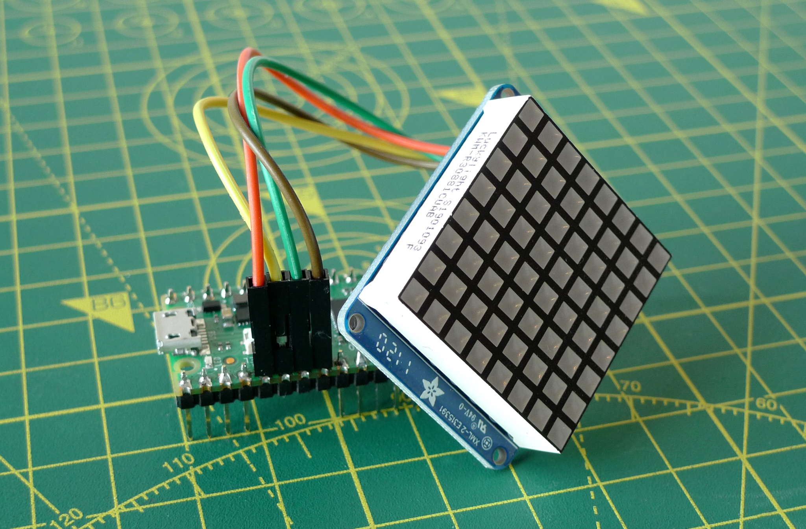
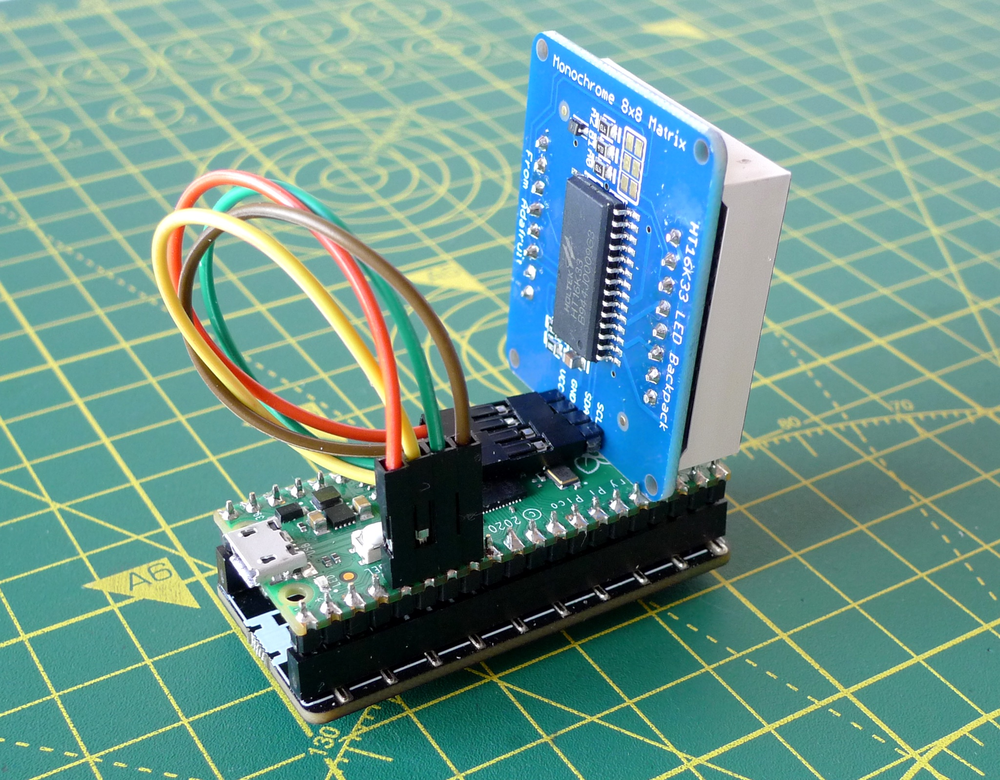

# Pico Weather 1.0.1

A Raspberry Pi Pico-based weather readout using the Pimoroni PicoWireless.



## Requirements

### Hardware

* Raspberry Pi Pico with [CircuitPython installed](https://circuitpython.org/board/raspberry_pi_pico/).
* [Pimoroni PicoWireless](https://shop.pimoroni.com/products/pico-wireless-pack).
* [HT16K33-based 8x8 LED Matrix plus I2C backpack](https://www.adafruit.com/product/1856).
* Male header.
* Female-to-female DuPont jumper wires.

### OpenWeather

You will need to create an [OpenWeather account](https://openweathermap.org/appid) (free) and obtain an API key (aka an App ID).

## Setup

### Hardware

This is slightly tricky because the PicoWireless docks onto a Pico with male header pins.

When you solder on the male header to the Pico, **do not solder pins 5, 6, 7 and 8**. When you have done, carefully push the unsoldered header pins up so that they rise up above the upper side of the Pico. Now solder the base of each pin to the Pico:



Solder the LED matrix to the backpack, and the backpack to the supplied male header as [described here](https://learn.adafruit.com/adafruit-led-backpack/1-2-8x8-matrix-assembly).

Now connect these pins using the DuPont wires:

| Backpack pin | Pico Pin |
| :-: | :-: |
| 3V3 | 5 |
| SDA | 6 |
| SCL | 7 |
| GND | 8 |



Now fit the Pico into the PicoWireless’ female header, taking care to get the correct orientation: the Pico’s USB connector should be at the same end as the PicoWireless’ MicroSD slot and USB print:



### Software

Connect the Pico to your computer. When the `CIRCUITPY` volume appears, copy across the following files and folders:

* `code.py`
* `lib`

Create a file on the `CIRCUITPY` volume called `secrets.py` and add the following code to it, replacing the `...` with your own values:

```python
secrets  = { "ssid": "...", "password": "...",
             "apikey": "...",
             "lat": ..., "lng": ...,
             "tz" ... }
```

`ssid` and `password` are your WiFi credentials; `apikey` is your OpenWeather API key; `lat` and `lng` are your location’s co-ordinates as decimal fraction values; `tz` is an optional plus or minus hours from GMT to indicate your timezone.

Do not save this file in your repo.

## Release Notes

* 1.0.1 *Unreleased*
    * Improve periodic redisplay timing.
* 1.0.0 *14 January 2022*
    * Initial public release.

## Licence and Copyright

For convenience, this repository includes software from Adafruit, specifically:

* [adafruit_esp32spi](https://github.com/adafruit/Adafruit_CircuitPython_ESP32SPI)
* [adafruit_bus_device](https://github.com/adafruit/Adafruit_CircuitPython_BusDevice)
* [adafruit_requests](https://github.com/adafruit/Adafruit_CircuitPython_Requests/)

These libraries’ source code files are copyright © 2019 ladyada for Adafruit Industries and are issued under the terms of the [MIT Licence](./LICENSE.md).

All other source code is copyright © 2020, 2022 Tony Smith and is also made available under the terms of the [MIT Licence](./LICENSE.md).