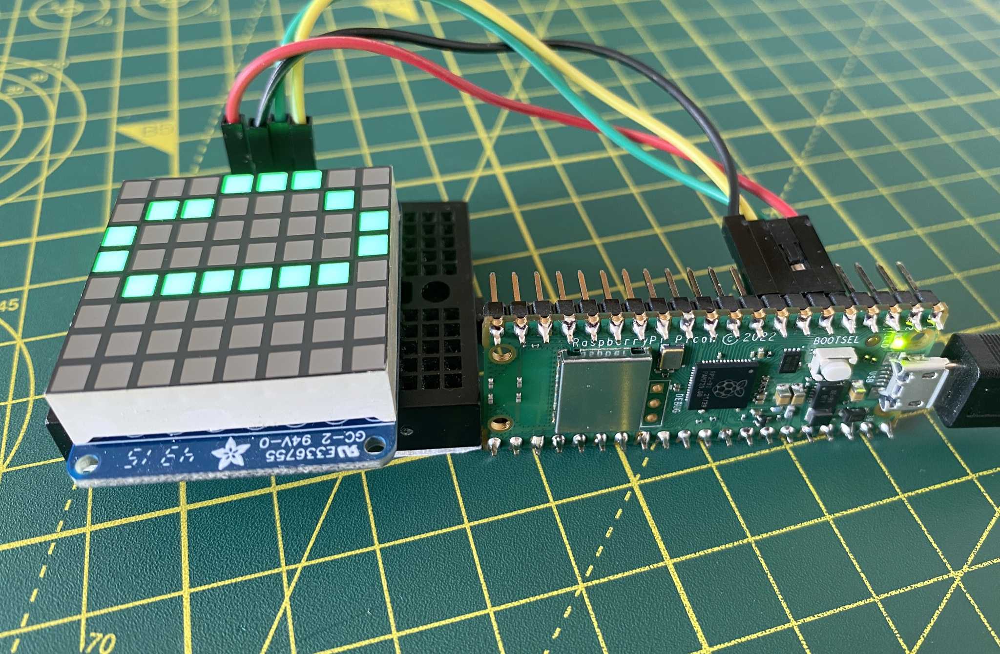

# Pico Weather 2.0.0

A Raspberry Pi Pico-based weather readout. There are two versions: one (Model A) using the Pico and the Pimoroni PicoWireless:


And a second (Model B) based on the Raspberry Pi Pico W:



**Note** The MicroPython release for the Pico W is currently considered “unstable”, so expect errors and issues!

## Requirements

### Hardware

#### Model A

* Raspberry Pi Pico with [CircuitPython installed](https://circuitpython.org/board/raspberry_pi_pico/).
* [Pimoroni PicoWireless](https://shop.pimoroni.com/products/pico-wireless-pack).

#### Model B

* Raspberry Pi Pico W with [MicroPython installed](https://micropython.org/download/rp2-pico-w/).

#### All Models

* [HT16K33-based 8x8 LED Matrix plus I2C backpack](https://www.adafruit.com/product/1856).
* Male header.
* Female-to-female DuPont jumper wires.

### OpenWeather

You will need to create an [OpenWeather account](https://openweathermap.org/appid) (free) and obtain an API key (aka an App ID).

## Setup

### Hardware

#### Model A

This is slightly tricky because the PicoWireless docks onto a Pico with male header pins.

When you solder on the male header to the Pico, **do not solder pins 5, 6, 7 and 8**. When you have done, carefully push the unsoldered header pins up so that they rise up above the upper side of the Pico. Now solder the base of each pin to the Pico:


Solder the LED matrix to the backpack, and the backpack to the supplied male header as [described here](https://learn.adafruit.com/adafruit-led-backpack/1-2-8x8-matrix-assembly).

Now connect these pins using the DuPont wires:

| Backpack pin | Pico Pin | GPIO Pin |
| :-: | :-: | :-: |
| 3V3 | 5 | 3 |
| SDA | 6 | 4 |
| SCL | 7 | 5 |
| GND | 8 | N/A |


Now fit the Pico into the PicoWireless’ female header, taking care to get the correct orientation: the Pico’s USB connector should be at the same end as the PicoWireless’ MicroSD slot and USB print:


#### Model B

Attach the LED matrix backpack to pins 5-8 as listed above. Because no add-on board is used for WiFi, you can connect the LED to headers soldered either above or below the Pico W.

### Software

#### Model A

Connect the Pico to your computer. When the `CIRCUITPY` volume appears, copy across the following files and folders:

* `code.py`
* `lib`

#### Model B

Connect the Pico W to your computer. You will need the [`pyboard.py`](https://raw.githubusercontent.com/micropython/micropython/master/tools/pyboard.py) utility to install the required files:

* Copy the `pyboard.py` code and save it to your computer at a location accessible via your terminal’s `$PATH` variable.
* Copy the files with:

```bash
python3 pyboard.py -d <YOUR_DEVICE_FILE> -f cp main.py :main.py
python3 pyboard.py -d <YOUR_DEVICE_FILE> -f cp openweather.py :openweather.py
python3 pyboard.py -d <YOUR_DEVICE_FILE> -f cp ht16k33.py :ht16k33.py
python3 pyboard.py -d <YOUR_DEVICE_FILE> -f cp ht16k33matrix.py :ht16k33matrix.py
```

You will need to determine the value you should substitue for `<YOUR_DEVICE_FILE>`. On Linux, it will probably be `/dev/ttyACM0`. On macOS, enter `ls /dev/cu*`. You should see an entry like: `/dev/cu.usbmodem14244201`. This is the Pico W’s device file.

#### All Models

Create a file on the mounted volume called `secrets.py` and add the following code to it, replacing the `...` with your own values:

```python
secrets  = { "ssid": "...", "password": "...",
             "apikey": "...",
             "lat": ..., "lng": ...,
             "tz" ... }
```

`ssid` and `password` are your WiFi credentials; `apikey` is your OpenWeather API key; `lat` and `lng` are your location’s co-ordinates as decimal fraction values; `tz` is an optional plus or minus hours from GMT to indicate your timezone.

Do not save this file in your repo.

## Release Notes

* 2.0.0 *29 July 2022*
    * Add MicroPython version for Pico W.
    * Reorganise repo for the two supported Pythons.
* 1.0.2 *27 January 2022*
    * Logging optimisation.
* 1.0.1 *17 January 2022*
    * Improve periodic redisplay timing.
* 1.0.0 *14 January 2022*
    * Initial public release.

## Licence and Copyright

For convenience, this repository includes software from Adafruit, specifically:

* [adafruit_esp32spi](https://github.com/adafruit/Adafruit_CircuitPython_ESP32SPI)
* [adafruit_bus_device](https://github.com/adafruit/Adafruit_CircuitPython_BusDevice)
* [adafruit_requests](https://github.com/adafruit/Adafruit_CircuitPython_Requests/)

These libraries’ source code files are copyright © 2019 ladyada for Adafruit Industries and are issued under the terms of the [MIT Licence](./LICENSE.md).

All other source code is copyright © 2022 Tony Smith and is also made available under the terms of the [MIT Licence](./LICENSE.md).
